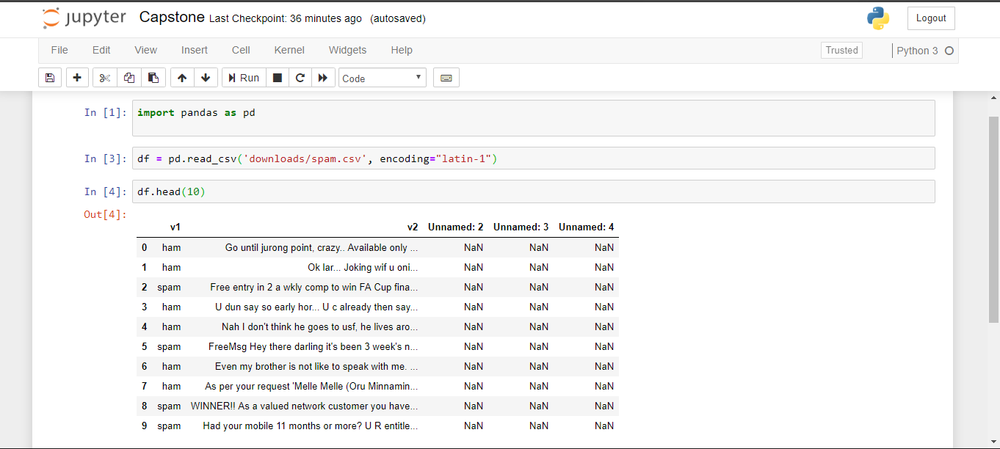
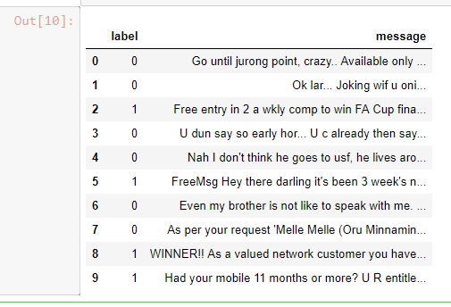
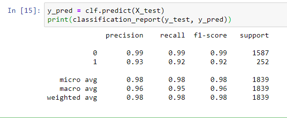
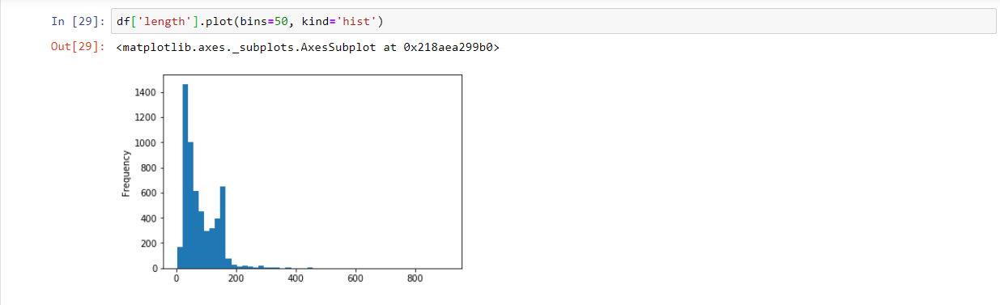
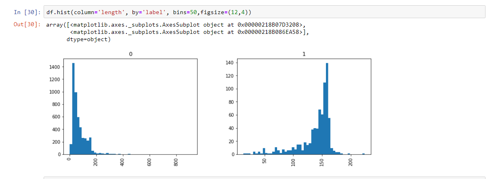

## Building and deploying a spam detection model
Spam is an unsolicited email message, instant message, or text message – usually sent to the recipient for commercial purposes. In other words, the recipient never explicitly asked for it, yet they get them.

We’re going to build a spam detection model in python to automatically classify a message as either spam or ham(legitimate messages). When we’re done building our model, we will host it on Heroku using Flask, a lightweight web application framework so that it becomes available for anyone to use.


## Building the Spam Message Classifier

* <b>Loading the Dataset</b>: The dataset we will use is a collection of SMS messages tagged as spam or ham and can be found [here](https://www.kaggle.com/uciml/sms-spam-collection-dataset/downloads/sms-spam-collection-dataset.zip/1#spam.csv) – go ahead and download it. Once you have the dataset, open your jupyter notebook and let’s get to work. Our first step is to load in the data using pandas read_csv function.

```python
import pandas as pd
df = pd.read_csv('spam.csv', encoding="latin-1")
```

Note that we specified encoding=”latin-1″ while reading the csv. This is because the csv file is utf-8 encoded. Failure to add that encoding, you’ll get an error message. Let’s go on



* <b>Cleaning the Dataset</b>: Observing the dataframe, we will notice how we have three columns Unnamed: 2, Unnamed: 3, Unnamed: 4 whose rows are NaN values. We will drop them because they’re not useful for our classification. We will also rename the v1 and v2 columns and give them appropriate titles:

```python
#Drop the columns not needed
df.drop(['Unnamed: 2', 'Unnamed: 3', 'Unnamed: 4'], axis=1, inplace=True)
#Create a new column label which has the same values as v1 then set the ham and spam values to 0 and 1 which is the standard format for our prediction.
df['label'] = df['v1'].map({'ham': 0, 'spam': 1})
#Create a new column having the same values as v2 column
df['message'] = df['v2']
#Now drop the v1 and v2
df.drop(['v1', 'v2'], axis=1, inplace=True)
df.head(10)
```


* <b>Creating the Bag of words Model</b>: Now that we have an idea of what our data looks like, next thing we want to do is to create a [bag-of-words model](https://machinelearningmastery.com/gentle-introduction-bag-words-model/) by leveraging the CountVectorizer function of the Scikit Learn package which we will use to create the bag of words model. This works by converting each of those messages into tokens and then we take all the words in our corpus and create a column with each word. Once fitted, CountVectorizer has built a dictionary of feature indices. The index value of a word in the vocabulary is linked to its frequency in the whole training corpus.

```python
from sklearn.feature_extraction.text import CountVectorizer
bow_transformer = CountVectorizer().fit_transform(df['message'])
```
* <b>Training a model</b>: With messages represented as vectors, we can finally train our spam vs ham classifier. Our choice classifier for this project is the Naive Bayes classifier algorithm because it suitable for document classification, since it works by constructing distributions over words. Let’s go ahead and create our model:
```python
from sklearn.model_selection import train_test_split
from sklearn.naive_bayes import MultinomialNB
from sklearn.metrics import classification_report
#Split the data
X_train, X_test, y_train, y_test = train_test_split(bow_transformer, df['label'], test_size=0.33, random_state=42)
#Naive Bayes Classifier
clf = MultinomialNB()
clf.fit(X_train,y_train)
clf.score(X_test,y_test)
y_pred = clf.predict(X_test)
print(classification_report(y_test, y_pred))
```
The output looks like this:



The model predicted with a 97% accuracy. 

* <b>Data Visualization</b>: 

                


* <b>Saving the classifier</b>: Let’s save the just completed model so that we can always reuse it whenever necessary. We will do this using:

```python
from sklearn.externals import joblib
joblib.dump(clf, 'our_model.pkl')
```

As a side note, when it’s time to use the model, we’ll load it using:

```python
spam_model = open('our_model.pkl','rb')
clf = joblib.load(spam_model)
```
## Deploying The Spam Detection Model

* <b>Setting up the development environment</b>: We’ll start by creating a virtual environment to manage all the packages needed for this application by following these steps below:

  - Create a new folder and cd into it. 

  - Initiate a virtual environment in your folder using: virtualenv .env

<b>Note</b>: Virtual environment has to be already installed on your computer for that command to work. Otherwise, install it from command prompt using: pip install virtualenv

  - Activate the .env file using: source .env/bin/activate
  - Initialize git using: git init
  - Then install the necessary packages:  pip install flask gunicorn nltk pandas sklearn numpy pickle 
  - Finally, create a requirements.txt file using: pip freeze > requirements.txt

<b>Note</b>: The requirements.txtfile is what Heroku needs to install those packages on the server in order for the application to run:


## License
MIT © [Francisca](#)
